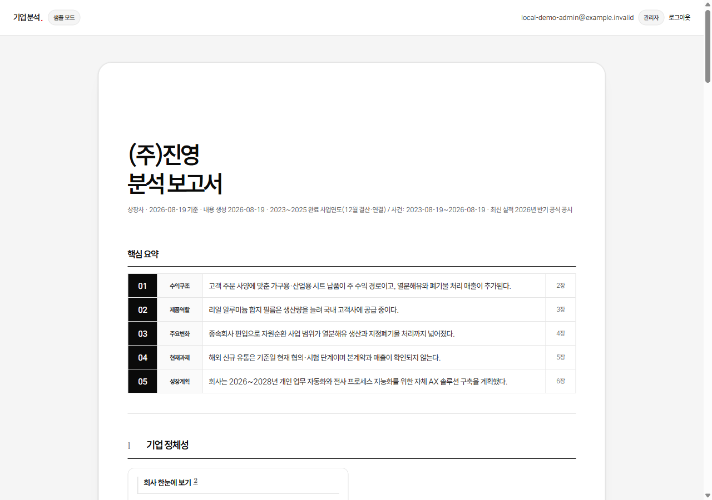
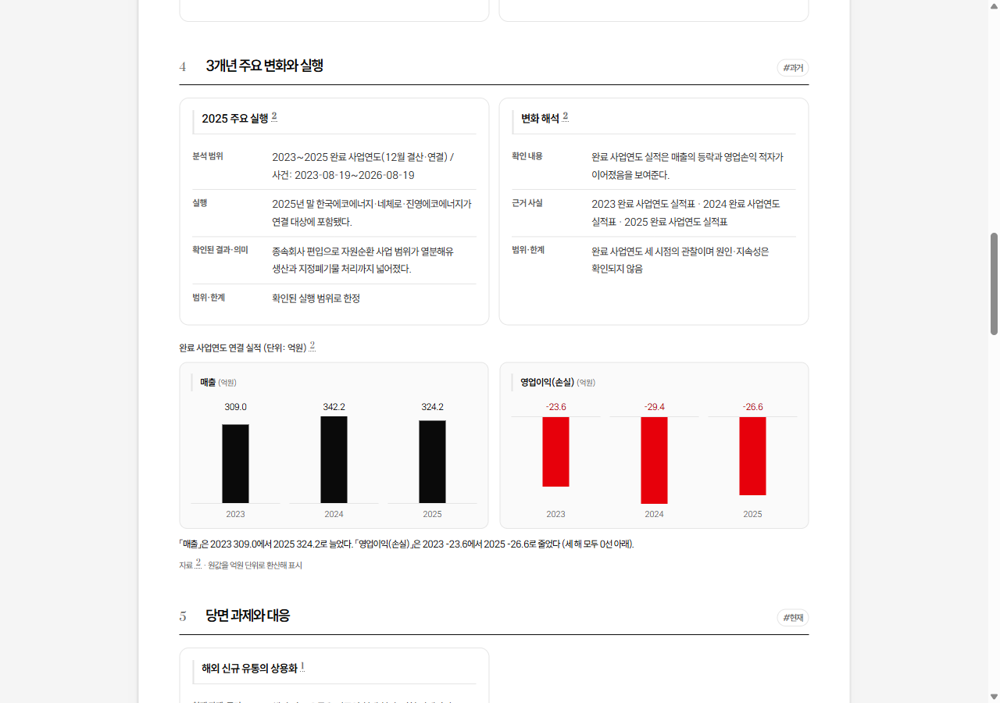
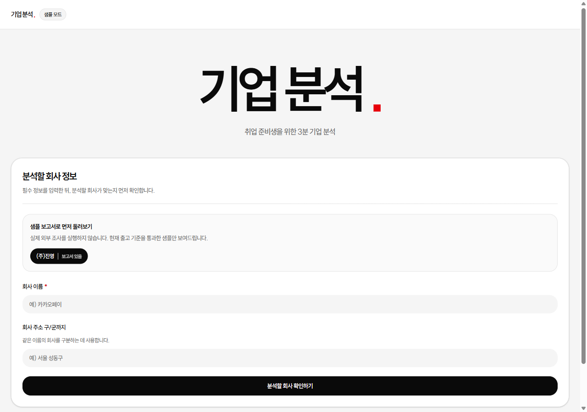
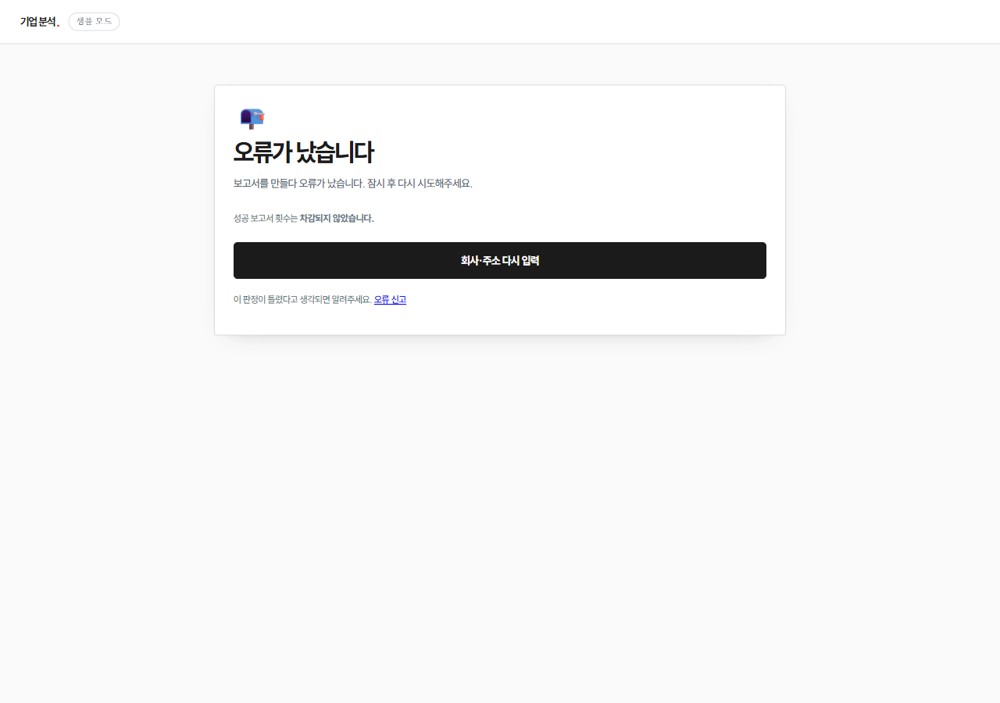

# 기업분석

**회사 이름 하나만 넣으면, 공시와 회사 공식 자료에서 근거를 모아 취업준비생용 기업분석 보고서를 만들어 줍니다.**

[](https://github.com/Jhh-wW/company-analysis/actions/workflows/quality-gate.yml)  

뉴스 검색과 AI의 자유 서술은 설계 단계에서 뺐습니다. 문장마다 어느 공식 원문에서 왔는지 각주가 붙고, 검사를 전부 통과한 보고서만 웹 · PDF · Notion 세 곳에 똑같이 나갑니다.

## 빠른 시작

Python 3.13이 필요합니다. 로컬 데모는 외부 API를 한 번도 부르지 않아 비용이 0원입니다.

```powershell
git clone https://github.com/Jhh-wW/company-analysis.git
cd company-analysis
py -3.13 -m venv .venv                    # 가상환경은 ★저장소 루트★에 만든다
.\.venv\Scripts\python -m pip install -r app\requirements.txt
cd app
.\로컬데모켜기.ps1                          # http://127.0.0.1:8000 (포트 변경 -Port 8010)
```

컨테이너는 `docker build --file app/Dockerfile --tag company-analysis .`로 만들고, 빌드 컨텍스트는 **저장소 루트**입니다(`app/`으로 좁히면 조사 엔진 복사가 깨집니다). 실행에 필요한 환경변수는 [`deploy/runtime-config.example`](deploy/runtime-config.example)에 있습니다.

## 구조

```text
app/                운영 웹서비스(FastAPI) — 화면·로그인·비용·저장·PDF·Notion
analysis_engine/    조사 엔진 — DART 공시와 회사 공식 웹사이트 수집
deploy/ · ops/      컨테이너·배포 계약, 운영 절차와 그 절차를 지키는 시험
docs/               보고서 정본 기준 · 아키텍처 · ADR
.github/workflows/  자동 시험과 컨테이너 스모크
```

## 시험

```powershell
.\.venv\Scripts\python -m pip install -r .github\requirements-ci.txt
.\.venv\Scripts\python -m pytest app/src app/tools/tests -q -m "not local_integration"
.\.venv\Scripts\python -m pytest analysis_engine/src -q
.\.venv\Scripts\python -m pytest deploy/tests -q
.\.venv\Scripts\python -m pytest ops -q
```

네 묶음은 각각 따로 실행합니다. `app/src`와 `analysis_engine/src`를 한 세션에 모으면 같은 이름의 시험 파일이 겹쳐 수집이 중단됩니다. 시험 건수처럼 변하는 숫자는 문서에 적지 않습니다 — 위 배지와 이 명령으로 직접 확인합니다.

## 라이선스

열람용으로 공개한 저장소입니다. 코드와 문서의 복제·수정·재배포·상업적 이용에는 저작권자의 허락이 필요합니다. 자세한 내용은 [LICENSE](LICENSE)에 있습니다.

---

## 이렇게 나옵니다



문장 옆의 작은 숫자는 **그 문장이 어느 공식 원문에서 왔는지**를 가리키는 각주입니다.



장마다 근거 사실과 **범위·한계**를 같이 적습니다. 확인되지 않은 것은 "확인되지 않음"이라고
쓰지, 그럴듯한 문장으로 메우지 않습니다.

## 무엇을 해결하나

회사 한 곳을 제대로 알아보려면 사업보고서·IR 자료·회사 홈페이지를 각각 열어 읽고 대조해야
합니다. 시간도 오래 걸리지만 더 큰 문제는 **어디까지가 회사가 공식적으로 밝힌 사실이고
어디부터가 기사나 블로그의 해석인지 구분이 안 된다**는 점입니다.

이 서비스는 그 구분을 자동으로 합니다. DART(금융감독원 전자공시)와 회사 공식 웹사이트에서
**원문 그대로** 근거를 모으고, 원문에 없는 문장은 보고서에 넣지 않습니다.

## 어떻게 동작하나

**1. 회사를 확정합니다.** 이름만 넣으면 후보를 보여 주고, 사람이 법인을 고릅니다.
같은 이름의 다른 회사를 잘못 분석하지 않기 위해서입니다.



**2. 공식 근거만 모읍니다.** DART 공시·회사 공식 웹사이트·IR 자료의 원문 조각을 모으고,
문장마다 원문 위치를 붙입니다. 같은 사실은 한 장만 소유하게 해서 중복을 막습니다.



**3. 원문 범위 안에서만 씁니다.** 원문과 글자까지 같은 문장은 그대로 확정하고, 나머지는
작성한 쪽과 별개인 검수 단계를 거칩니다. 검수를 통과하지 못한 문장은 삭제합니다.

**4. 검사를 다 통과해야 내보냅니다.** 목차·출처·수치·중복·금지 문구와 PDF 전 페이지 렌더를
검사합니다. **하나라도 걸리면 일부만 보여주지 않고 보고서 전체를 막습니다**(`GATE_STOPPED`).
반쯤 검증된 보고서는 읽는 사람에게 검증된 것처럼 보이기 때문입니다.

## 보고서 목차

목차는 회사마다 달라지지 않게 고정했습니다. 목차가 흔들리면 여러 회사를 비교할 수 없습니다.

| 장 | 내용 | 장 | 내용 |
|---|---|---|---|
| 0 | 핵심 요약 | 5 | 당면 과제와 대응 `#현재` |
| 1 | 기업 정체성 | 6 | 성장 전략 `#미래` |
| 2 | 사업 구조와 수익 모델 | 7 | 사업 운영과 파트너 구조 |
| 3 | 핵심 제품·서비스 | 8 | 인재상과 일하는 방식 |
| 4 | 3개년 주요 변화와 실행 `#과거` | 9 | 동종업계에서의 경쟁우위 |
| | | 부록 | 출처와 검증 상태 |

1~9장이 모두 필수입니다. 9장은 다른 회사와 숫자를 맞대는 비교표가 아니라, 회사가 공식
자료에 밝힌 **업계의 모습과 그 안에서 이 회사가 가진 강점**을 쓰는 장입니다.
근거가 얇으면 그 장을 한 번 더 채워보고, 그래도 기준에 못 미치면 9장만 뺀 보고서를 내는
대신 **보고서를 내지 않습니다.** 이때는 요금을 청구하지 않습니다.

## 기능

- **공식 근거만 수집** — DART 공시와 회사 공식 웹사이트의 원문 조각. 각 문장이 어느 원문
  어느 위치에서 왔는지 식별자로 추적됩니다.
- **사실 원장과 단일 소유** — 같은 사실이 여러 장에 중복해 나오지 않게 사실마다 소유 장을
  하나만 둡니다. 과거·현재·미래 시점도 사실 단위로 구분합니다.
- **출고 게이트(fail-closed)** — 검사를 하나라도 통과하지 못하면 부분 공개 없이 전체를 막습니다.
- **웹 · PDF · Notion 동등 출력** — 같은 보고서 객체를 채널만 바꿔 렌더합니다. PDF는 전 페이지를
  이미지로 떠서 구조·시각 검사까지 통과해야 다운로드가 열립니다.
- **비용 상한과 동시 실행 제한** — 조사 1건마다 단계별 비용을 기록하고 상한에서 끊습니다.
- **초대 링크** — 관리자가 회사별 링크를 발급하면 주소와 QR을 한 번만 보여 줍니다. 링크로
  들어온 사람은 로그인 없이 그 회사 보고서를 보고 다른 회사도 이어서 조사할 수 있습니다.
  링크마다 하루·누적 이용 한도와 만료일이 있고, 한도를 다 쓰면 새 조사는 막히지만 미리
  만들어 둔 보고서는 계속 열립니다.
- **회원 명단** — 구글 로그인만으로는 아무 권한도 생기지 않습니다. 관리자가 초대 명단에
  넣은 계정만 로그인 벽을 통과하고, 사람마다 하루 성공 보고서 건수와 비용 한도를 따로 줍니다.
- **관리자 화면** — 오늘 상태 · 초대 링크 · 회원 · 보고서 · 비용 · 운영 여섯 묶음입니다.
  링크 철회·회원 빼기·한도 변경·만료 연장은 확인 화면을 거쳐야 실행되고, 한도 변경과
  만료 연장은 이유도 20자 이상 적어야 합니다.

## 만들면서 내린 선택

**뉴스 검색을 넣었다가 다시 뺐다** — 처음에는 뉴스로 기사 후보를 모아 AI가 고르게 했습니다.
실제로 돌려 보니 공개 사실 판정 단계에서 뉴스 조각이 **항상 폐기**되고 있었습니다. 효과 없이
AI 호출과 입력 토큰만 늘려서 공식 경로에서는 검색 단계 자체를 제거했습니다.

**실패하면 전부 막는다** — 대안은 «통과한 장만 보여주기»였습니다. 그러면 실패한 이유가 화면에서
사라지고 읽는 사람은 남은 내용을 «검증된 것»으로 받아들입니다. 그래서 검사 하나만 실패해도
보고서 전체를 막습니다.

**SQLite + 단일 인스턴스** — 동시 사용자가 적은 베타에서는 운영 비용보다 단순함이
이득이라고 봤습니다. 대신 그 전제를 **말이 아니라 시험으로** 못 박았습니다. `render.yaml`의
`numInstances: 1`과 영속 disk 설정을 시험이 직접 읽어 검사하고, 이 전제를 깨려면 무엇을 먼저
만들어야 하는지를 [배포 교체 계약](docs/architecture/deployment-contract.md)에 남겼습니다.

**레이어가 아니라 기능 단위로 나눴다** — `models/ services/ routers/`로 나누면 기능 하나를 고칠 때
폴더 세 개를 오갑니다. 그래서 `app/src/features/<기능>/` 안에 그 기능의 로직·상수·시험을 같이 뒀습니다.
버그가 생기면 **폴더 하나만 열면 됩니다.** ([ADR 0001](docs/adr/0001-feature-oriented-structure.md))

**기본값을 안전한 쪽에 뒀다** — 외부 AI를 실제로 부르는 `real` 모드는 코드 기본값이 아닙니다.
코드 기본값은 비용 0인 `demo`이고, 운영 배포에서만 `render.yaml`이 `real`로 올립니다.
로컬에서 실수로 요금이 나갈 수 없습니다.

## 지금의 한계

- **아무나 쓸 수 있는 서비스가 아닙니다.** `BETA_ADMIN_ONLY=1`이라 관리자와 초대 명단에
  있는 회원, 그리고 초대 링크로 들어온 사람만 조사를 시작할 수 있습니다.
- **자동 배포를 꺼 뒀습니다.** 커밋을 올려도 사람이 직접 배포를 누르기 전에는 반영되지 않습니다
  (`render.yaml`의 `autoDeployTrigger: off`). 보고서 품질이 걸린 서비스라 의도한 설정입니다.
- **정기 작업(cron)이 아직 붙지 않았습니다.** 외부 백업·주간 리포트·휴지통 정리는 코드와 인증
  경로까지 있지만 스케줄이 선언돼 있지 않습니다.
- **수평 확장이 안 됩니다.** SQLite와 인메모리 작업 상태 때문에 인스턴스 1개가 계약입니다.

## 문서

- [문서 지도](docs/README.md) — 어떤 문서를 어떤 순서로 읽는지
- [보고서 구조](docs/REPORT_STRUCTURE.md) · [출력물 기준](docs/출력물%20기준/README.md) — 보고서가 지켜야 하는 정본
- [시스템 개요](docs/architecture/system-overview.md) · [기능별 책임 지도](docs/architecture/feature-map.md)
- [검수 안내](docs/REVIEW_GUIDE.md) — 직접 돌려 보고 시험까지 확인하는 절차
- [기여 안내](CONTRIBUTING.md) · [취약점 신고](SECURITY.md)

## 만든 사람 · 데이터 출처

1인 개발. 기획·설계·구현·배포·문서를 혼자 했습니다.

데모용 표본은 **DART(금융감독원 전자공시시스템)에 공시된 공개 자료**에서 가져왔습니다.
실제 API 키·OAuth 비밀값·데이터베이스·로그는 저장소에 넣지 않으며 환경변수로만 주입합니다.
